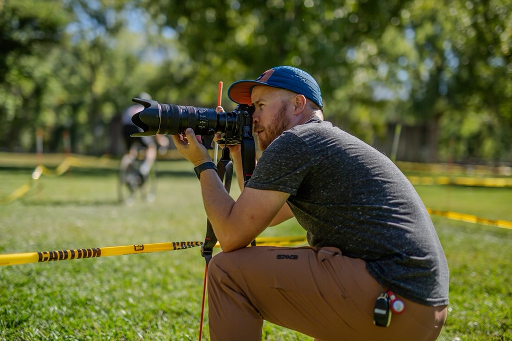
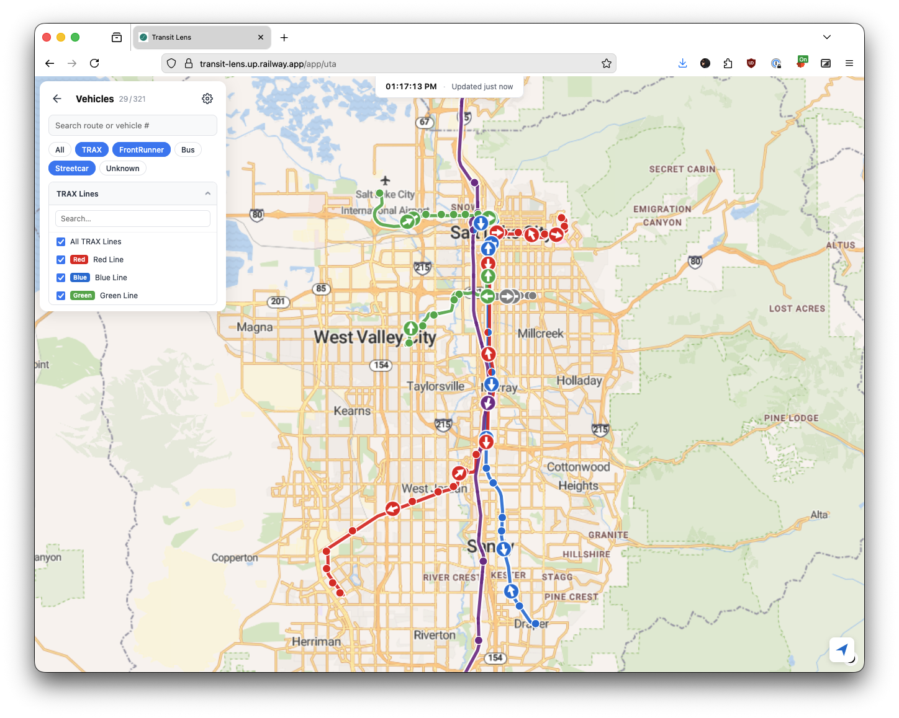
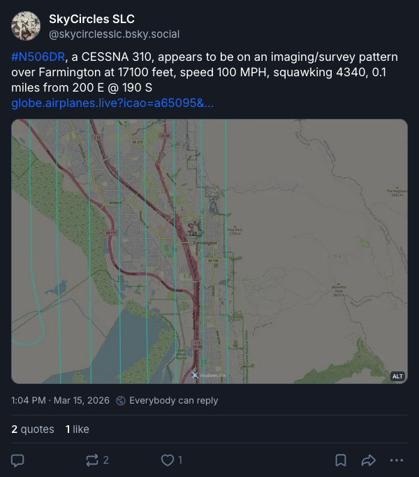

# Sawyer Pangborn

## Software Engineer at Fidelity Investments

Experienced and cutting-edge full stack web developer and web designer with solid UX experience. Excels in both creative and logical aspects of software development and design. Open source enthusiast.

## Photographer at [Sawyer Likes Bikes](https://www.sawyer.bike)

Action sports and cycling photography.

## Personal Projects

### [Transit Lens](https://transit-lens.up.railway.app)

A project to consume and display GTFS and GTFS Real Time data from various transit organizations using an Angular frontend. Built out of a curiosity to understand an entire transit system and the way GTFS works.

### Watcher in the Sky

A Bluesky bot leveraging public ADS-B data to post about aircraft that are circling or flying imaging/survey flight patterns in the Salt Lake City area. Posts to Bluesky at [@skycirclesslc.bsky.app](https://bsky.app/profile/did:plc:wj3ngreim3s6cqlwqszdl3lo).
